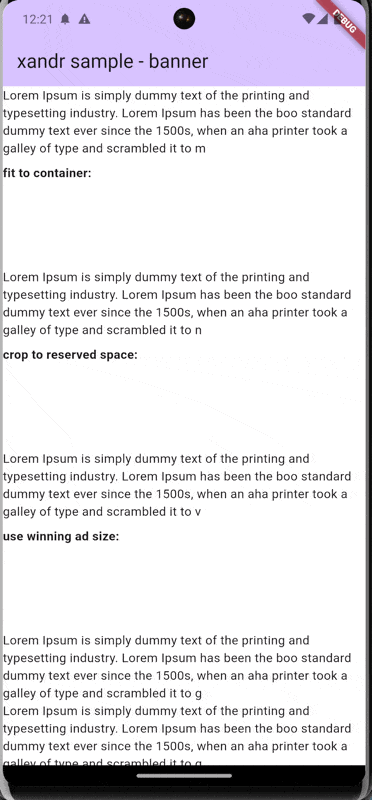
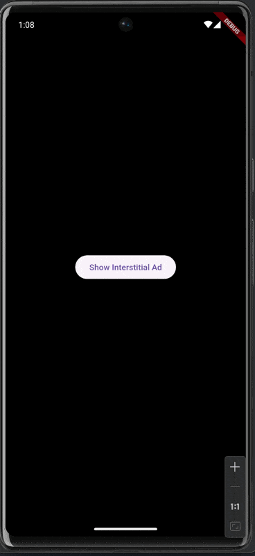

# xandr

 

This is the flutter integration for xandr.

## Contributing to the project

Please the [CONTRIBUTING.md](CONTRIBUTING.md) for details.

## example usage:

**The flutter api is work in progress and will likely change.**
**NOTE: up to this point there is only an android implementation of basic banner ads**

However there are three main concepts:
- there is a central `XandrController()` which:
  - when called with `XandrController().init(memberId)` will initialize the sdk
  - takes care of loading ads
  - propagates ad events to the flutter side
- there is a `XandrBuilder()` widget which:
  - simplifies handling of the global `XandrController()`
  - makes sure that all child-ads are only requested once the sdk is successfully initialized
- there is an `AdBanner()` widget which:
  - can request banners by size options, `placementId` and/or `inventoryCode`
  - `customKeywords` are also supported
  - behind the scenes the widget size is adjusted accordingly, and the ad is reloaded after a given amount of time
- there is an `InterstitialAd()` which:
  - can request an interstitial by `placementId` and/or `inventoryCode`
  - `customKeywords` are also supported
  - after the ad is loaded, it can be shown by calling `show()`

### sample code:

For a running examples please check the sample app at [example/lib/main.dart](packages/xandr/example/lib/main.dart) - the sample app can be run using `melos run run:example -- -d sdk` (android only atm).

In order to initialize the xandr sdk, and show a banner ad run:

```dart
_controller = XandrController();
...
XandrBuilder(
    controller: _controller,
    memberId: 9517,
    builder: (context, snapshot) {
        if (snapshot.hasData) {
            debugPrint('Xandr SDK initialized, success=${snapshot.hasData}');
            return AdBanner(
                controller: _controller,
                inventoryCode: 'bunte_webdesktop_home_homepage_hor_1',
                adSizes: const [AdSize(728, 90),],
                customKeywords: useDemoAds,
            );
        } else if (snapshot.hasError) {
            return const Text('Error initializing Xandr SDK');
        } else {
            return const Text('Initializing Xandr SDK...');
        }
    },
)
```

**Result:**



Also, results of the `AdResponse` are propagated to the flutter side:

```
...
I/flutter (16949): xandr.onAdLoaded: 0, size=728x90, creativeId=158504583, adType=BANNER, tagId=20835075, auctionId=6349340599071400911, cpm=0.10855, memberId=9517
...
```

Loading an interstitial ad is similar, however its a two step process:

  1. loading the ad

```dart
...
_interstitialAd = InterstitialAd(
  controller: _controller,
  inventoryCode: 'bunte_webphone_news_gallery_oop_0',
);
...
```

  2. showing the ad with optional auto-hide after a given amount of time

```dart
XandrInterstitialBuilder(
  interstitialAd: _interstitialAd,
  builder: (context, snapshot) {
    if (snapshot.hasData) {
      debugPrint('Xandr interstitial ad loaded, '
          'success=${snapshot.hasData}');
      return Column(
        mainAxisAlignment: MainAxisAlignment.center,
        children: [
          ElevatedButton(
            onPressed: () async {
              debugPrint('show interstitial ad...');
              final result =
                  await _interstitialAd.show(autoDismissDelay: 10);
              debugPrint(
                'interstitial ad has been closed result=$result',
              );
            },
            child: const Text('Show Interstitial Ad'),
          ),
        ],
      );
    } else if (snapshot.hasError) {
      return const Text('Error loading Xandr interstitial ad');
    } else {
      return const Text('Loading Xandr interstitial ad...');
    }
  },
)
```

***Result:***



To run the interstitial example app, run `melos run run:example:interstitial -- -d sdk` (android only atm).